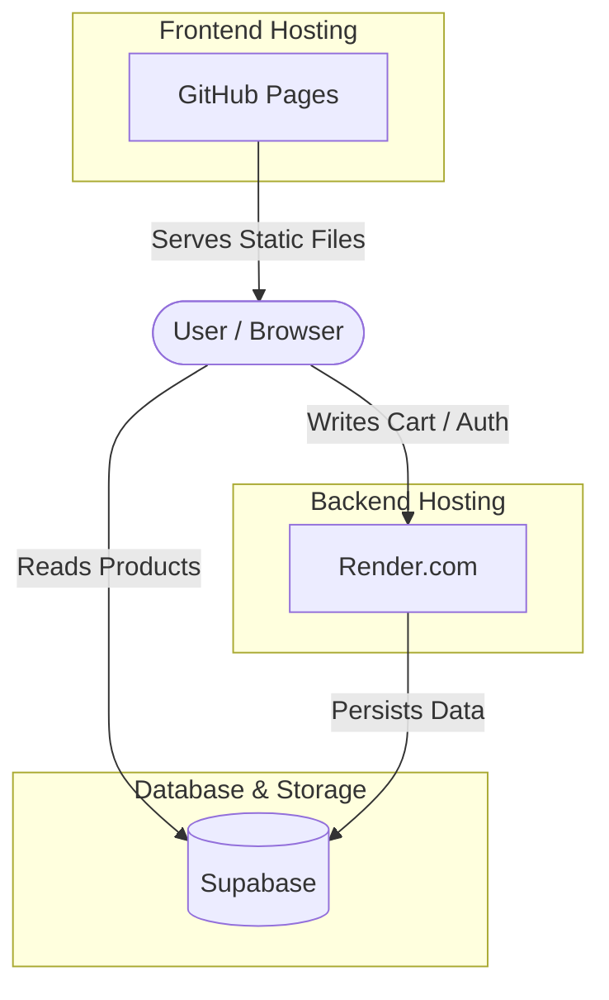

# Shopping System

A robust, production-ready shopping cart system built with **FastAPI** and **PostgreSQL**.

This project demonstrates advanced architectural patterns including **CQRS** (Command Query Responsibility Segregation), **Domain-Driven Design (DDD)** principles, and a structured **Logging System** with correlation IDs.

## 🌟 Key Architectural Features

### 1. CQRS (Command Query Responsibility Segregation)
The system separates **Command** (Write) operations from **Query** (Read) operations to optimize performance, scalability, and security.

- **Commands**: Complex write operations (adding/removing items) are handled through dedicated services that enforce strict business rules, transactional integrity, and concurrency control.
    - Example: `CartService.add_item` orchestrates the command, handling pessimistic locking (`SELECT FOR UPDATE`) to prevent race conditions on stock and cart state.
- **Queries**: The Read side is powered by **Supabase**.
    - The frontend application queries Supabase directly via its auto-generated API.
    - This separation allows for high-performance reads and real-time subscriptions without loading the primary transactional backend.

### 2. Domain Services using DDD
This project explicitly uses **Domain Services** for business logic that spans multiple entities/aggregates, rather than forcing this logic into a single entity or leaking it into the application layer.

**Why Domain Services?**
In `src/shopping/domain.py`, you will see functions like `add_item_to_cart(cart, product, quantity)`.

- **Vs. Entity Method**: Placing this logic on the `Cart` entity would require the `Cart` to know about and modify `Product` stock, violating the `Product` aggregate's boundary. Placing it on `Product` would require `Product` to know about `Cart` internals.
- **Vs. Service Layer**: Placing this logic in the `CartService` (Application Layer) would lead to an "Anemic Domain Model," where entities are just data holders and business rules are scattered in the service layer.

The **Domain Service** approach encapsulates this cross-aggregate logic (`Cart` items + `Product` stock) within the domain layer, keeping the core business rules pure and testable.

### 3. Structured Logging & Correlation IDs
The system implements a robust logging strategy in `src/logging_config.py` and `src/main.py`.

- **Correlation IDs**: Every request is assigned a unique `X-Correlation-ID`.
- **Context Handling**: Uses Python's `contextvars` to propagate this ID through the call stack automatically.
- **Traceability**: All logs generated during a request (application code, database queries, errors) are tagged with this ID, allowing for complete end-to-end tracing of a single request across the system.

## 🛠️ Technology Stack

- **Framework**: FastAPI
- **Database**: PostgreSQL (SQLAlchemy ORM)
- **Containerization**: Docker & Docker Compose
- **Testing**: Pytest (Integration & Unit tests)

## 🔄 CI/CD Pipeline

The pipeline (`.github/workflows/deploy.yml`) ensures code quality and automates deployment:

- **CI (Integration)**: Runs on every push/PR.
    - **Linting**: Checks formatting with `black`.
    - **Testing**: Executes `pytest` against a real **PostgreSQL** service container.
- **CD (Deployment)**: Runs only on `main` branch after successful CI.
    - **Build & Push**: Builds Docker image and pushes to **GHCR**.
    - **Deploy**: Triggers **Render** deployment via webhook.

## 📂 Project Structure

```bash
src/
├── auth/           # Authentication module
├── shopping/       # Shopping domain module
│   ├── domain.py       # Domain models & services (Pure Python)
│   ├── models.py       # Database models (SQLAlchemy)
│   ├── repository.py   # Data access layer
│   ├── schemas.py      # Pydantic models (DTOs)
│   ├── service.py      # Application service (Orchestration)
│   └── router.py       # API endpoints
├── logging_config.py   # Logging setup
└── main.py             # Application entrypoint
```

## 🎮 Live Demo

- **Frontend Application**: [Launch Demo](https://li-kuan-gi.github.io/shopping-system-fast-api/frontend)
- **Backend API Docs**: [Swagger UI](https://shopping-system-fast-api-latest.onrender.com/docs)

### Deployment Architecture



> [!NOTE]
> The backend is hosted on Render's free tier, which spins down after periods of inactivity. If the service is "cold," the first request (such as adding an item to the cart) may take up to 60 seconds to process as the instance boots up.

## 💻 Local Development

Follow these steps to run the backend engine locally.

### Prerequisites
- Docker & Docker Compose
- Python 3.11+

### Installation

1. **Clone the repository**
   ```bash
   git clone https://github.com/li-kuan-gi/shopping-system-fast-api
   cd shopping-system-fast-api
   ```

2. **Set up Environment**
   ```bash
   python -m venv .venv
   source .venv/bin/activate  # On Windows: .venv\Scripts\activate
   pip install -r requirements.txt
   ```

3. **Configure Environment**
   Create a `.env` file in the root directory (see `.env.example`).
   ```bash
   cp .env.example .env
   ```
   *Note: `JWT_SIGNING_KEY` is simply an **ES256 JWK** (JSON Web Key) used to verify tokens. While we use Supabase in production, any valid ES256 key pair will work for local testing.*

   **Generate Local Keys**:
   Run the included helper script to generate a valid key pair and a test token:
   ```bash
   python src/generate_keys.py
   ```
   1. Copy the output JSON into your `.env` as `JWT_SIGNING_KEY`.
   2. Use the printed `Bearer <token>` to authenticate requests against your local API.

4. **Run Services (Database)**
   ```bash
   docker-compose -f docker-compose.test.yml up -d
   ```

5. **Initialize Database**
   Create tables and seed initial product data:
   ```bash
   python -m src.init_db
   ```
   *Seeds products with IDs: 1, 2, 3*

6. **Run the Application**
   ```bash
   uvicorn src.main:app --reload
   ```

   The API will be available at `http://127.0.0.1:8000`.
   API Documentation (Swagger UI): `http://127.0.0.1:8000/docs`
